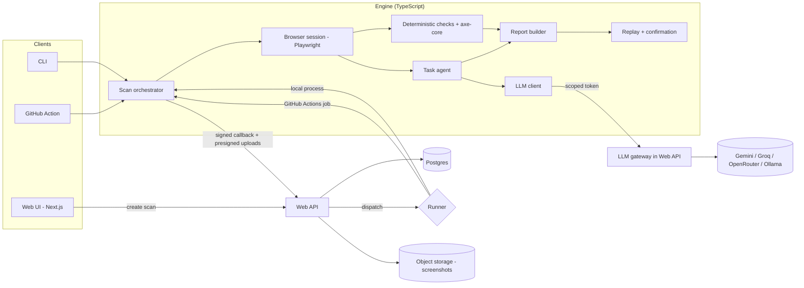

# AccessScout — Blueprint (working title)

> Status: draft v0.1 · Written: 2026-10-04 · Owner: Cacing
> This file is the source of truth for **what** we build and **how it is structured**.
> Build order lives in `PLAN.md`. Coding rules for the AI coding agent live in `AGENTS.md`.
> "AccessScout" is a placeholder name. Check name and trademark availability before publishing.

---

## 1. Summary

AccessScout is an open-source tool that tests websites for accessibility problems **the way a real keyboard user (and later a screen-reader user) experiences them**. Automated scanners such as axe-core catch only part of all WCAG issues; the rest appear only when someone actually navigates, opens dialogs, and submits forms. AccessScout combines deterministic browser checks with a small, tightly bounded AI layer, and reports every problem with **repeatable steps, evidence, and a confirmed/unconfirmed status**.

It ships as three things that share one engine:
1. A **CLI** (`accessscout scan <url>`) that outputs a JSON report.
2. A **GitHub Action** that scans a preview or staging URL and comments on pull requests.
3. A **web app** where a user verifies ownership of a site, runs scans, and views reports.

The project is a **skills showcase and open-source portfolio piece**, not a commercial-grade service.

## 2. Goals and non-goals

### Goals
- G1. Find issues scanners miss by exercising keyboard behavior, focus management, dialogs, and forms.
- G2. Every finding is **reproducible**: replayable steps + evidence. Unreproducible findings are labeled `unconfirmed`.
- G3. **Honest measurement**: a public benchmark (injected-defect fixtures, W3C ACT test cases, labeled LLM-judgment set) with reproducible scripts and published failures.
- G4. **Safe by design**: untrusted web content never gets access to secrets; the AI cannot take arbitrary actions.
- G5. **Free to develop and demo** (free tiers, public repo, free CI minutes).
- G6. **Open source** with a clear README, docs, tests, and release.

### Non-goals
- Certifying or claiming WCAG/EAA/ADA compliance. Output must never say "compliant" or "passed accessibility."
- Replacing manual audits or testing with real users and assistive technology.
- Automatic code fixes (suggested fixes as text are fine; auto-PRs are out of scope).
- Mobile apps, PDFs, native apps.
- Scanning sites without permission. Submitting real payments or destructive actions.
- Competing with commercial vendors on features or scale.

## 3. Verified facts and assumptions

Mark any new claim you add as **Verified (link)** or **Assumption**.

### Verified (checked during research, Oct 2026)
- Playwright has `locator.ariaSnapshot()` (v1.49) and `page.ariaSnapshot()` (v1.59). Use these instead of the older `page.accessibility.snapshot()`. Source: https://playwright.dev/docs/release-notes
- `@axe-core/playwright` provides `AxeBuilder`; axe-core was at v4.11.x and applies WCAG 2.2 rules per recent guides. Source: https://dev.to/vitalyskadorva/accessible-web-testing-with-playwright-and-axe-core-2kg1
- W3C ACT Rules each have official test cases labeled passed / failed / inapplicable. Source: https://www.w3.org/TR/act-rules-format-1.0/
- Guidepup automates real screen readers (VoiceOver on macOS, NVDA on Windows) and offers a virtual screen reader that its authors say should not replace real testing. Sources: https://github.com/guidepup/guidepup , https://github.com/guidepup/virtual-screen-reader
- GitHub Actions: standard GitHub-hosted runners are free for public repositories. Source: https://github.com/resources/insights/2026-pricing-changes-for-github-actions
- Running untrusted pull-request code with secrets is a known "pwn request" risk; GitHub advises secretless handling of untrusted code. Source: https://docs.github.com/en/actions/reference/security/securely-using-pull_request_target
- Automated scanners detect only part of WCAG issues (vendor figures range from about a quarter to a third; axe-core's own listing claims about 57%). Sources: https://www.optimum-web.com/blog/european-accessibility-act-website-compliance-2026/ , https://github.com/marketplace/actions/axle-a11y-wcag-accessibility-ci
- Competitors exist: TestParty, Deque (axe MCP), UsableNet, Level Access, Siteimprove; BrowserStack has screen-reader automation (alpha) and an AI issue-detection agent. Sources: https://www.webyes.com/blogs/top-accessibility-remediation-tools/ , https://www.browserstack.com/docs/accessibility/screen-reader-launcher/screen-reader-automation-overview
- Free LLM tiers exist (e.g., Gemini Flash models, Groq), with limits that change often; Gemini's free tier may use data for training. Sources: https://pecollective.com/tools/gemini-free-tier-guide/ , https://geotoolbox.ai/blog/gemini-api-pricing

### Assumptions (verify before relying on them)
- A1. Using GitHub Actions public-repo runners as scan workers is allowed under GitHub's terms. **Read the terms before building Phase 3.**
- A2. Free tiers for hosting and database keep their current limits during development.
- A3. Guidepup runs reliably on GitHub-hosted Windows/macOS runners (it is optional; Phase 8).
- A4. A machine-readable ACT test-case file is available from the ACT Rules site (check act-rules.github.io).
- A5. All dependency licenses are compatible with the chosen project license (check at bootstrap).

## 4. Users and use cases

| User | Use | Entry point |
|---|---|---|
| Developer | Scan local dev server or staging; read findings; replay | `accessscout scan http://localhost:3000` |
| Team | Gate pull requests on new issues | GitHub Action + PR comment (+ SARIF) |
| Site owner / agency | Verify a site, run scans, share a report link | Web app |
| Contributor | Add a check, add a mutator, run the benchmark | `pnpm eval`, docs |

## 5. Architecture

### 5.1 Principles
1. **Engine first.** The CLI produces a schema-validated JSON report. Web app and CI wrap the engine; they never reimplement it.
2. **Deterministic first.** Use code for anything that can be measured. Use an LLM only for bounded, fuzzy judgments and for choosing what to explore.
3. **Evidence first.** No finding without replayable steps or deterministic evidence.
4. **Least privilege.** Processes that browse untrusted pages hold no provider API keys. LLM calls go through a gateway with a scoped, short-lived token.
5. **Measure everything.** Every change to a check or prompt is evaluated against the benchmark before merge.
6. **Provider-agnostic.** LLM access behind one interface; free and local models supported.
7. **Free-tier friendly.** Prefer designs that run at $0 for development and demo.

### 5.2 System diagram



### 5.3 Components

| Component | Responsibility | Notes |
|---|---|---|
| `schema` | Zod schemas + TS types for config, steps, findings, report | Versioned: `schemaVersion` |
| `core` | Browser session, page loading, step recorder, replay, limits | Playwright; no LLM here |
| `checks` | Deterministic checks and axe wrapper | Each check implements one interface |
| `llm` | Provider adapters, cache, budgets, structured-output validation | Direct (local/dev) or Gateway client |
| `agent` | LLM judgments and task agent (flows) | Strict action allowlist |
| `eval` | Fixture server, mutators, scorer, ACT adapter, benchmark report | Reproducible, CI-runnable |
| `cli` | `scan`, `replay`, `eval`, `report` commands | Thin wrapper |
| `apps/web` | UI, API routes, auth, gateway, runner dispatch | Next.js |

### 5.4 Scan lifecycle (web path)
1. User submits URL + config. API checks ownership verification (or demo-allowlist), rate limits, and creates `scan` (status `queued`).
2. API issues a **scan-scoped token** (expires; bound to scan id; budget: max LLM calls/tokens) and dispatches a runner job with inputs: `scan_id`, `callback_url`, `token`, `config`.
3. Runner starts the engine from a **pinned commit of this repo** (never code from the scanned site), runs the scan, and streams progress events via signed callbacks.
4. Screenshots go to object storage through presigned upload URLs; JSON report posted to the callback.
5. API validates the report against `schema`, stores findings, marks scan `completed`/`failed`, and exposes the report.
6. Optional: replay confirmation runs at the end of step 3 (default on).

### 5.5 Runner abstraction
`Runner` interface with two implementations:
- `LocalProcessRunner` — spawns the CLI locally (dev, tests, Docker Compose).
- `GitHubActionsRunner` — triggers a `workflow_dispatch` on this public repo using a fine-grained token or GitHub App, then waits for callbacks.
Adding a third runner (container service) later must not change the engine.

### 5.6 LLM gateway
- Lives in the Web API. Endpoint: `POST /api/llm/complete` (structured output request: `taskType`, `promptVersion`, `input`, `jsonSchema`).
- Enforces: per-scan budget, max input size, allowed `taskType`s, provider routing, caching by content hash, request logging (no secrets, redact page text beyond a limit).
- The runner holds only the scoped token. **Provider keys exist only in the web environment.**
- CLI standalone mode uses `DirectProvider` with the user's own env key. Same `LlmClient` interface.

## 6. Tech stack

Pin exact versions at bootstrap by checking current stable releases. Do not rely on remembered API shapes; verify against current docs.

- Language: TypeScript (strict) everywhere. Playwright, axe-core, and Guidepup are JS-native.
- Runtime: current Node.js LTS. Package manager: pnpm workspaces.
- Browser automation: Playwright (Chromium first; Firefox/WebKit later).
- Rules engine: `@axe-core/playwright` (`AxeBuilder`).
- Validation: Zod at every boundary (config, LLM output, callbacks, DB inserts).
- Tests: Vitest for ALL tests. Browser tests use the plain `playwright` library inside Vitest. No `@playwright/test` and no second runner.
- Web: Next.js (App Router), Auth.js with GitHub OAuth, Tailwind. Drizzle ORM + Postgres.
- DB/storage (free tier): Neon or Supabase Postgres; Supabase Storage or Cloudflare R2 for screenshots behind a storage adapter.
- LLM: adapters for Gemini (free Flash tier), Groq, OpenRouter, Ollama (local dev).
- CI: GitHub Actions. Lint: ESLint + Prettier. Typecheck: `tsc --noEmit`.
- Screen reader (optional, Phase 8): Guidepup on Windows (NVDA) / macOS (VoiceOver) runners.
- Logging: pino (structured). No telemetry by default.

## 7. Repository layout

```
accessscout/
├─ AGENTS.md
├─ BLUEPRINT.md
├─ PLAN.md
├─ LICENSE                     # decide at bootstrap (MIT or Apache-2.0)
├─ packages/
│  ├─ schema/                  # zod schemas, types, JSON Schema export
│  ├─ core/                    # browser session, steps, replay, limits
│  ├─ checks/                  # K-xxx, A-001 wrappers, helpers
│  ├─ llm/                     # providers, cache, budgets, gateway client
│  ├─ agent/                   # judgments (L-xxx), task agent
│  ├─ eval/                    # fixtures server, mutators, scorer, ACT adapter
│  └─ cli/
├─ apps/
│  └─ web/                     # Next.js app + API routes + gateway
├─ fixtures/
│  ├─ sites/                   # baseline accessible demo sites (static)
│  ├─ mutations/               # mutator definitions + expected findings
│  ├─ judgments/               # labeled alt-text/link/error-message samples
│  └─ expected/                # PROTECTED: expected outcomes (human review only)
├─ benchmarks/                 # published results (json + markdown)
├─ docs/                       # ADRs, how-tos, check reference
├─ .github/workflows/          # ci.yml, scan.yml, eval.yml
└─ docker-compose.yml          # local dev: web + postgres
```

## 8. Core engine

### 8.1 Pipeline
1. **Load** — open URL in a fresh browser context; apply limits (timeout, max pages, same-origin policy, resource limits).
2. **Observe** — capture ARIA snapshot, DOM facts, screenshot (compressed), console errors.
3. **Static checks** — axe-core run (tagged WCAG 2.0–2.2 A/AA; best-practice rules reported separately).
4. **Keyboard checks** — deterministic Tab traversal and focus analysis (see catalog).
5. **LLM judgments** — bounded inputs (alt text, link names, headings, form messages), structured outputs, cached.
6. **Task agent** — optional flows (menus, dialogs, forms, checkout-like flows) under an action allowlist and budgets.
7. **Normalize** — convert everything into `Finding` objects; dedupe by fingerprint; map to WCAG success criteria.
8. **Replay** — re-run each finding's steps in fresh contexts (default 3 runs); mark `confirmed` if reproduced at least 2 of 3.
9. **Report** — build the JSON report; render a Markdown/HTML summary.

### 8.2 Check interface (sketch)

```ts
interface Check {
  id: string;                    // e.g. "K-001"
  title: string;
  wcag: string[];                // e.g. ["2.1.1"]
  kind: "deterministic" | "heuristic" | "llm";
  run(ctx: CheckContext): Promise<RawFinding[]>;  // never throws on page errors; returns diagnostics
}
```
Each check must: declare WCAG mapping, document limits, include fixtures for pass/fail/inapplicable, and emit replayable `steps`.

### 8.3 MVP check catalog

| ID | What it detects | WCAG (2.2) | Method |
|---|---|---|---|
| A-001 | axe-core rules (tagged, de-duplicated) | various | deterministic (library) |
| K-001 | Interactive elements unreachable by keyboard | 2.1.1 | Tab traversal vs. interactive-element inventory |
| K-002 | Keyboard trap | 2.1.2 | Detect focus cycles with no exit via Tab/Shift+Tab/Esc |
| K-003 | No visible focus indicator | 2.4.7 | Computed-style + screenshot diff of focused vs. blurred |
| K-004 | Focused element obscured (sticky header, banner) | 2.4.11 | Geometry + `elementFromPoint` at focused element |
| K-005 | Illogical focus order | 2.4.3 | Heuristic: DOM vs. visual order, positive tabindex (low confidence) |
| K-006 | No skip/bypass mechanism | 2.4.1 | Heuristic |
| K-007 | Dialog focus management (move in, contain, restore) | 2.4.3, 2.1.2, 4.1.2 | Agent-triggered, deterministic assertions |
| K-008 | Form errors not programmatically associated/announced | 3.3.1, 4.1.3 | Agent-triggered submit; check aria-describedby/errormessage/live regions |
| K-009 | Horizontal scroll at 320 CSS px (reflow) | 1.4.10 | Viewport resize + scroll width check |
| K-010 | Small interactive targets | 2.5.8 | Bounding boxes (+ axe rule) |
| K-011 | Dynamic status changes without live region | 4.1.3 | Heuristic: DOM mutation without live-region semantics |

### 8.4 LLM judgments (bounded)

| ID | Input (max size enforced) | Output | WCAG |
|---|---|---|---|
| L-001 | image alt, filename, nearby text, role | verdict: adequate / filename-like / redundant / should-be-empty / misleading; confidence | 1.1.1 |
| L-002 | link/button name + surrounding sentence | verdict on purpose clarity; confidence | 2.4.4, 2.4.6 |
| L-003 | heading outline + page title | verdict on meaningful structure; confidence | 2.4.6, 1.3.1 |
| L-004 | form field label/instructions; error text | verdict on clarity/helpfulness; confidence | 3.3.2, 3.3.3 |

Rules:
- Output must be JSON validated by Zod. Invalid output = retry once, then drop with a diagnostic.
- Findings whose only evidence is an LLM verdict get `source: "llm"` and status `needs-review` unless a deterministic corroboration exists. They never count as `confirmed`.
- Prompts are versioned files (`promptVersion`). Changing a prompt requires a benchmark run.
- Page text is **untrusted data**: wrap in delimiters, instruct the model to ignore instructions inside, and never pass model output to a shell, selector engine, or URL without validation.

### 8.5 Task agent (flows)
Goal: complete simple user tasks using **keyboard only** and observe where the experience breaks.

- The model proposes up to K tasks from the ARIA snapshot (e.g., "open the navigation menu", "search", "open a product dialog", "submit the contact form").
- Allowed actions (enum, validated): `press(key)` where key ∈ {Tab, Shift+Tab, Enter, Space, Escape, ArrowUp, ArrowDown, ArrowLeft, ArrowRight, Home, End}; `focusByTabbing(accessibleName, maxTabs)`; `typeText(syntheticValue)` into the focused field; `navigate(sameOriginUrl)`; `wait(≤2000ms)`; `snapshot()`.
- Not allowed: raw JS execution, arbitrary selectors from model output, cross-origin navigation, file upload, payment submission, deletion actions. Form submission only when `allowFormSubmission=true` and the site is flagged as staging.
- Budgets (provisional defaults): ≤40 steps/task, ≤5 tasks/scan, ≤60 LLM calls/scan, 10-minute scan timeout.
- Observers (deterministic) record focus path, ARIA diffs, live-region events, and trigger checks K-007/K-008.
- If a target cannot be reached by keyboard within the tab budget, that **is** a finding (K-001 variant).

### 8.6 Replay and confirmation
- Every finding carries `steps: Step[]` (deterministic actions + expected observation).
- `accessscout replay <report.json> --finding <id>` re-runs in a fresh context.
- Status: `confirmed` (≥2/3 reproduce), `unconfirmed` (<2/3), `needs-review` (LLM-only evidence).
- Record per-check flake rate; surface in the benchmark.

### 8.7 Report schema (sketch)

```ts
const Finding = z.object({
  id: z.string(),                       // stable within a report
  fingerprint: z.string(),              // ruleId + normalized selector + page + step hash
  ruleId: z.string(),                   // "K-003", "axe:color-contrast", "L-001"
  wcag: z.array(z.string()),
  severity: z.enum(["critical", "serious", "moderate", "minor"]),
  source: z.enum(["axe", "keyboard", "agent", "llm", "screenreader"]),
  status: z.enum(["confirmed", "unconfirmed", "needs-review"]),
  confidence: z.number().min(0).max(1),
  title: z.string(),
  description: z.string(),
  pageUrl: z.string().url(),
  target: z.object({ selector: z.string().optional(), accessibleName: z.string().optional(), role: z.string().optional() }),
  steps: z.array(Step),                 // replayable
  evidence: z.array(Evidence),          // screenshot refs, aria snippet, focus path, axe node data
  suggestedFix: z.string().optional(),  // text only
  llm: z.object({ model: z.string(), promptVersion: z.string() }).optional(),
});

const Report = z.object({
  schemaVersion: z.literal("1"),
  tool: z.object({ name: z.string(), version: z.string(), commit: z.string().optional() }),
  scan: z.object({ startedAt: z.string(), finishedAt: z.string(), baseUrl: z.string().url(), config: ScanConfig }),
  pages: z.array(PageSummary),
  findings: z.array(Finding),
  diagnostics: z.array(Diagnostic),     // timeouts, blocked actions, invalid LLM outputs
  usage: z.object({ llmCalls: z.number(), inputTokens: z.number(), outputTokens: z.number(), durationMs: z.number() }),
  disclaimer: z.string(),
});
```

Every report and UI view must include the disclaimer: *"Automated findings only. This tool does not certify WCAG, EAA, or ADA compliance and cannot replace manual testing with assistive technology and real users."*

## 9. Web app and API

### 9.1 Pages
- `/` landing + demo scan on curated demo sites
- `/sites` list, add site, verification instructions/status
- `/scans` list; `/scans/[id]` report view (filters: status, source, severity, WCAG; finding detail with steps, screenshots, copyable replay command)
- `/s/[token]` read-only shared report link (revocable)
- `/docs` check reference (generated from the check catalog)

### 9.2 Data model (Postgres)
- `users(id, github_id, email, created_at)`
- `sites(id, user_id, origin, verification_method, verification_token, verified_at)`
- `scans(id, site_id, status, config_json, runner, started_at, finished_at, llm_calls, tokens_in, tokens_out, error)`
- `findings(id, scan_id, fingerprint, rule_id, severity, source, status, confidence, page_url, payload_json)`
- `evidence(id, finding_id, type, storage_key, bytes, created_at)`
- `scan_tokens(id, scan_id, token_hash, expires_at, max_llm_calls, used_llm_calls)`
- `share_links(id, scan_id, token_hash, revoked_at)`
- `llm_cache(key_hash, task_type, prompt_version, output_json, created_at)`

### 9.3 API (all validated with Zod)
- `POST /api/sites`, `POST /api/sites/:id/verify`
- `POST /api/scans` → creates, dispatches runner
- `GET /api/scans/:id`, `GET /api/scans/:id/report.json`
- `POST /api/runner/callback` (HMAC-signed, scan-scoped; progress + final report)
- `POST /api/runner/upload-url` (presigned storage upload, size/type limited)
- `POST /api/llm/complete` (gateway; scan-scoped bearer token)
- `POST /api/share`, `DELETE /api/share/:id`

### 9.4 Limits (provisional)
Per user: 5 scans/day, 2 concurrent. Per scan: ≤10 pages, ≤30 screenshots (WebP, ≤1280px wide), ≤10 minutes. Retention: 30 days; delete-on-request.

## 10. Security and abuse prevention

1. **Ownership verification** for non-demo targets: well-known file, DNS TXT, or meta tag. The verification fetch in the web API must be SSRF-hardened (resolve DNS, block private/link-local/metadata ranges, re-check after redirects, cap size/time).
2. **Demo allowlist**: curated, intentionally inaccessible demo sites that need no verification.
3. **Secrets lanes**: the runner/browser process never receives provider keys. Only a short-lived, scan-scoped token for the LLM gateway and a signed callback secret.
4. **Pinned code**: runners execute a pinned commit of this repo. No code from scanned sites is ever executed outside the browser sandbox.
5. **Prompt injection**: treat page content as hostile. Delimit inputs, constrain outputs with schemas, restrict actions to the allowlist, validate any element reference against the current ARIA snapshot, and never execute model-produced strings.
6. **Browser hardening**: no persistent profile, no downloads, block file:// and non-http(s) schemes, same-origin navigation by default, request/response size limits, disable permissions (camera, geolocation, notifications).
7. **Abuse controls**: auth, rate limits, per-scan budgets, concurrency caps, kill switch to disable scanning.
8. **Privacy**: do not store page text beyond what evidence needs; redact obvious secrets/emails in stored snapshots; 30-day retention.
9. **Legal text**: disclaimer in reports; Terms stating "scan only sites you own or are authorized to test."
10. **Free LLM tier privacy**: treat free-tier inputs as potentially used for training; only scan public demo/your own sites in that mode.

## 11. Evaluation (the core of the portfolio value)

### 11.1 Datasets
1. **Baseline fixtures**: 3 small static sites that start accessible (zero axe violations; pass all K-checks): *article/blog*, *shop with cart + checkout-like form*, *forms + dialogs + menu app*.
2. **Mutators** (injected single defects) with expected findings (see 11.2).
3. **W3C ACT test cases** for rules that overlap our checks (passed/failed/inapplicable). Report consistency per check.
4. **Labeled judgment set**: ≥100 hand-labeled items per judgment type (alt text, link names, error messages), split dev/test, labeled by the owner with written guidelines. Report agreement metrics.
5. **Real-world sanity runs**: only on sites the owner controls or intentionally inaccessible demo sites.

### 11.2 Mutator catalog (start with ~20)

| ID | Injected defect | Expected finding |
|---|---|---|
| M01 | Remove `alt` on informative image | axe image-alt |
| M02 | Alt text replaced with filename | L-001 |
| M03 | Input label disassociated | axe label |
| M04 | Icon-only button without name | axe button-name |
| M05 | Clickable `div`, not focusable | K-001 |
| M06 | `outline: none` on focus, no replacement | K-003 |
| M07 | Keyboard trap in a widget | K-002 |
| M08 | Positive `tabindex` scramble | K-005 |
| M09 | Sticky header covers focused element | K-004 |
| M10 | Skip link removed | K-006 |
| M11 | Dialog opens, focus not moved in | K-007 |
| M12 | Dialog closes, focus not restored | K-007 |
| M13 | Error shown by color only; not associated | K-008 |
| M14 | Error not announced (no live region) | K-008 / K-011 |
| M15 | Fixed-width layout → horizontal scroll at 320px | K-009 |
| M16 | 12px tap targets | K-010 |
| M17 | Low contrast text | axe color-contrast |
| M18 | Many "click here" links | L-002 |
| M19 | Heading levels skipped / no h1 | axe + L-003 |
| M20 | Menu opens on hover only | K-001 / flow finding |

### 11.3 Metrics
- **Recall** per mutator class (found/injected). **Precision** = findings on unmutated baselines (false positives per page; target zero on fixtures).
- **Per-source precision** (axe / keyboard / agent / llm).
- **Stability**: flake rate across 5 runs; replay confirmation rate.
- **Judgment quality**: accuracy, macro-F1, confusion matrix on the held-out test split; model-by-model comparison.
- **Cost and speed**: LLM calls, tokens, wall time per scan.
- **Coverage gap view**: which WCAG criteria are covered by which checks (honest list of what is *not* covered).

### 11.4 Gates (provisional; set real thresholds after the first baseline)
- Deterministic mutators: recall ≥ 0.90 on fixtures; baseline false positives = 0.
- Flake rate ≤ 2% on deterministic checks.
- Any PR changing a check, mutator, prompt, or fixture must attach a before/after benchmark diff.

### 11.5 Publishing
`benchmarks/results-YYYY-MM-DD.json` + generated Markdown table in README. Include failures and known limitations. Record versions of Playwright, axe-core, browser, and model ids so results are reproducible.

## 12. Deployment and cost ($0 development target)

| Part | Choice | Caveat |
|---|---|---|
| Scan workers | GitHub Actions standard runners on a **public** repo | Verify terms (A1); larger runners are billed |
| Web app | Vercel Hobby (non-commercial) or equivalent | Hobby tier is for personal/non-commercial use |
| Database | Neon or Supabase free Postgres | Small size; may pause when idle |
| Screenshots | Supabase Storage or Cloudflare R2 behind adapter | Check free limits at build time; compress; 30-day retention |
| LLM | Gemini Flash free tier; Groq; Ollama locally | Limits change; free tiers may train on data |
| CI | GitHub Actions | Keep eval-smoke fast |

Local dev: `docker-compose up` (web + Postgres) and `LocalProcessRunner`.
Environment variables are documented in `.env.example`. Never commit secrets.

Free tiers change quietly; re-check limits before each phase that depends on them.

## 13. What makes this portfolio-worthy

- A **public, reproducible benchmark** with honest failure analysis.
- **Replayable findings** (no trust required).
- **Security design** that separates browsing from secrets and constrains the AI.
- **Provider-agnostic LLM layer** with a gateway, budgets, and caching.
- **CI integration** (PR comments + SARIF).
- Clean docs: architecture decision records (ADRs), check reference, contribution guide.

README outline: problem → demo GIF → quick start (3 commands) → what it finds that scanners miss → benchmark table → architecture diagram → limitations (explicit) → contributing.

## 14. Risks and mitigations

| Risk | Mitigation |
|---|---|
| Agent flakiness / false alarms | Deterministic-first; replay confirmation; `unconfirmed`/`needs-review` labels |
| WCAG interpretation disputes | Map each check to criteria with documented rationale; mark heuristics low-confidence |
| Scope creep | Hard phase gates; cut list in PLAN.md |
| Free-tier changes | Adapters for storage/LLM/runner; local mode always works |
| Prompt injection from pages | Section 10 controls; allowlisted actions; schema-validated outputs |
| Overclaiming | Mandatory disclaimer; never use the word "compliant" |
| Crowded market | Position as open, measured, reproducible; do not claim novelty |
| Screen-reader automation instability | Optional phase; advisory findings only |

## 15. Open questions
1. Final project name and license (MIT vs Apache-2.0).
2. Which two or three demo sites ship in the public demo list.
3. Whether to support Firefox/WebKit in v0.1 (default: Chromium only).
4. Exact LLM provider order for the default configuration.
5. Whether the web app is required for v0.1, or CLI + Action + benchmark is the first release (recommended: CLI + benchmark first).

## 16. Sources
- Playwright release notes: https://playwright.dev/docs/release-notes
- axe + Playwright guide: https://dev.to/vitalyskadorva/accessible-web-testing-with-playwright-and-axe-core-2kg1
- ACT Rules Format: https://www.w3.org/TR/act-rules-format-1.0/
- Guidepup: https://github.com/guidepup/guidepup · https://www.guidepup.dev/
- GitHub Actions pricing: https://github.com/resources/insights/2026-pricing-changes-for-github-actions
- Securing untrusted PR code: https://docs.github.com/en/actions/reference/security/securely-using-pull_request_target
- EAA/ADA enforcement context: https://taylancetech.com/blog/website-accessibility-crackdown-2026-business-guide · https://web-accessibility-checker.com/en/blog/accessibility-lawsuits-statistics-2026
- Competitor overview: https://www.webyes.com/blogs/top-accessibility-remediation-tools/
- BrowserStack screen reader automation: https://www.browserstack.com/docs/accessibility/screen-reader-launcher/screen-reader-automation-overview
- Free tiers: https://pecollective.com/tools/gemini-free-tier-guide/ · https://snapdeploy.dev/state-of-free-hosting
